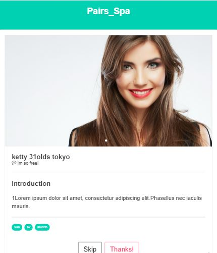

## pairs_project
summer intership's script feat. - vue.js- 

* * *

* * *

vue matching app's UI
A simple componet,has Burma css framework.

### version
v1.1 Supported vue2.0+

### impression
https://paper.dropbox.com/doc/Pairs-frontend-Project-9ezXsTJ4dy6S5nIVIWzuu
